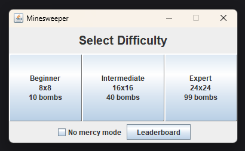
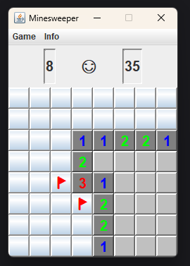
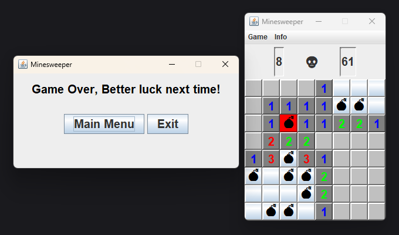
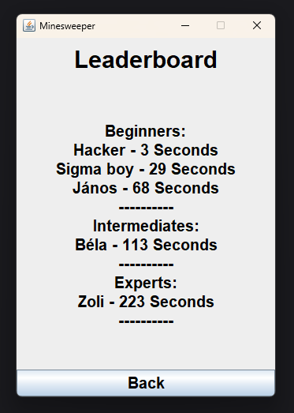

# 💣 Minesweeper 

### About
This is a Minesweeper game coded in java. There are 3 maps(difficulties) you can choose from, these are the following:

 - 8x8 tiles with 10 bombs (Beginner)
 - 16x16 tiles with 40 bombs (Intermediate)
 - 24x24 tiles with 99 bombs (Expert)

 It also features a leaderboard, that displays and ranks the top 5 players in each difficulty by time of completion. If you complete a map, you can type in your name and get on the leaderboard (if you're fast enough).

 There is a special mode called "No mercy mode". I'll let you discover that.

---

 ### Used technologies
  - Object oriented programming in java for the logic
  - Swing used for UI

---

### How to run
Double click MineSweeper.jar

### Screnshots showcasing the gameplay

